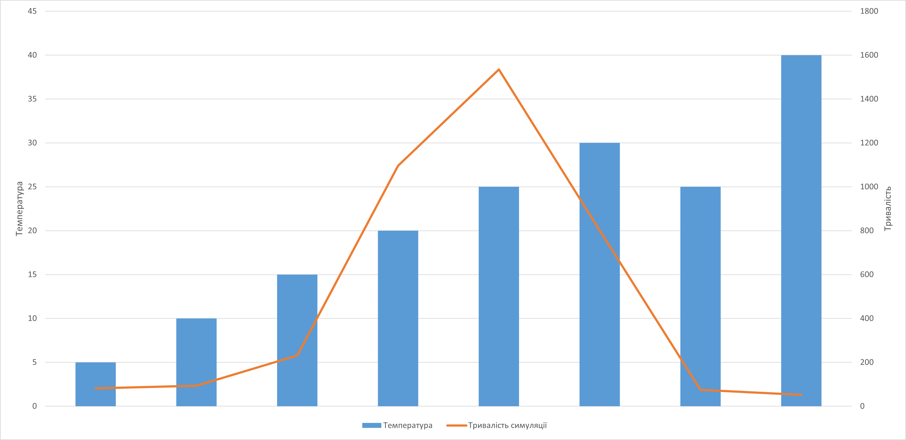
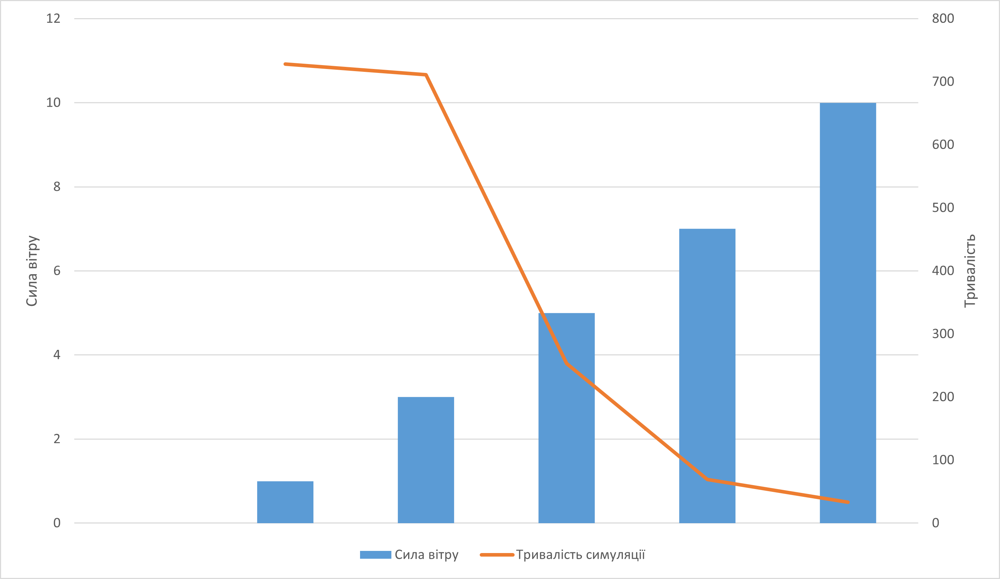
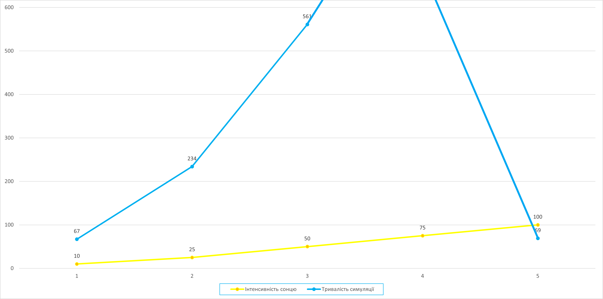

## Комп'ютерні системи імітаційного моделювання
## СПм-22-3, **Білоконь Антон Сергійович**
### Лабораторна робота №**1**. Опис імітаційних моделей та проведення обчислювальних експериментів

 

### Варіант 11, модель у середовищі NetLogo:
[Autumn](https://www.netlogoweb.org/launch#http://www.netlogoweb.org/assets/modelslib/Sample%20Models/Biology/Autumn.nlogo)

 

### Вербальний опис моделі:
Ця модель імітує те, як листя змінює свої кольори та опадає, що дає змогу дослідити та зрозуміти це прекрасне річне видовище. Кольори, які ми бачимо в кожному листі, походять від присутності природних речовин, які виробляються та зберігаються в кожному листі. На колір листя впливають три речовини:
- Зелений колір походить від хлорофілу (або набору споріднених речовин, відомих як хлорофіли), який перетворює сонячне світло та воду на цукор. Молекули хлорофілу руйнуються і не відновлюються, коли вони піддаються впливу надмірного сонячного світла та коли температура низька. Таким чином, холодні сонячні осінні дні призводять до зниження загальної концентрації хлорофілу. Загальна концентрація хлорофілу знову зростає під час сонячного світла (якщо його не надто багато!) і коли є вода.
- Жовтий колір походить від речовини під назвою каротин. Молекули каротину допомагають надати колір моркви та батату. Концентрація каротину залишається постійною протягом усього життя листка. Однак жовтий колір часто маскується зеленим кольором хлорофілу. Лист з більшою кількістю хлорофілу (типово влітку) буде виключно зеленим, хоча і з сильними жовтими відтінками, замаскованими за зеленим. Проте коли хлорофіл гине, стає очевидною присутність каротину, що призводить до жовтого листя.
- Червоний походить від речовини під назвою антоціани. Молекули антоціану утворюються за наявності високих концентрацій цукру та води в листі. (Чим вища концентрація цукру, тим більше утворюється антоціанів.) Концентрація цукру зростає, коли холодна погода змушує дерево перекривати циркуляцію води до решти дерева; будь-яка вода та цукор, що потрапили в лист, потім перетворюються на антоціани.  

Кожен хід годинника в моделі складається з двох етапів: (1) погода (дощ, вітер, сонце) впливає на листя, додаючи або видаляючи цукор, воду чи хлорофіл відповідно до обставин, і (2) лист реагує на навколишнє середовище. , додаючи антоціани за необхідності та змінюючи колір відповідно до модифікованого середовища.

 

### Керуючі параметри:

- **number-of-leaves** - цей параметр вказує, скільки листів буде присутньо в середовищі під час запуску симуляції. Змінюючи значення "number-of-leaves" за допомогою
  відповідного слайдера, маємо змогу впливати на кількість листів, які будуть проходити етапи під час виконання симуляції.
- **start-sugar-mean** - цей параметр вказує, яке середнє значення для змісту цукру серед листя.
- **start-sugar-stddev** - цей параметр вказує, розподіл початкового розподілу цукру серед листя.
- **temperature** - цей параметр вказує, на температуру навколишнього середовища.
- **rain-intensity** - цей параметр вказує, на інтенсивність дощу.
- **wind-factor** - цей параметр вказує, на силу вітру навколишнього середовища.
- **sun-intensity** - цей параметр вказує, на інтенсивність впливу сонця.

### Внутрішні параметри:
- **water-level** - відображає кількість води в листі.
- **sugar-level** - показує кількість цукру в листі.
- **attachedness** - визначає, наскільки тісно лист прикріплений до дерева.
- **chlorophyll** - відображає рівень хімічних речовин, що забарвлюють листя в зелений колір.
- **carotene** - визначає рівень хімічних речовин, які надають листю жовтий колір.
- **anthocyanin** - показує рівень хімічних речовин, які забарвлюють листя в червоний колір.
- **location** - показує місце знаходження капель дощу, може бути "падає", "у коренях", "у стовбурі" чи "у листі".
- **amount-of-water** - показує кількість води.
- **bottom-line** - визначає, де знаходиться поверхня землі.
- **evaporation-temp** - температура, при якій вода випаровується.

### Показники роботи системи:

- **Leaves** - графік відображення двох показників живих листів та мертвих листів (які впали на землю).
- **Weather conditions** - графік відображення погодних умов таких як: дощ, сонце, температура, вітер.
- **Leaf averages** - графік відображення середніх значень змісту таких складників таких як: хлорофіл, вода, цукор, каротин, антоціан, приєднання (міцність з якою
  тримається лист).

### Примітки:

- За відсутності вітру листя на деревах протримається дуже тривалий час.
- При середній інтенсивності сонячного світла та близької до нуля температури навколишнього середовища листя зберігається на дереві довше, зважаючи на ключову роль, яку відіграє сонце в цьому процесі.

### Недоліки:

– У реальному житті дощ впливає на процес опадіння листя, але у нашій моделі цей аспект ігнорується.
- Зміна кольору листя відбувається рівномірно, без урахування природного захисту внутрішніх шарів від зовнішніх впливів.

 

## Обчислювальні експерименти
### 1. Вплив температури на кількість часу, що листя буде триматись на дереві.
Досліджується залежність кількості тактів від керуючого параметру **temperature**.
Інші керуючі параметри мають значення за замовчуванням:
- **number-of-leaves**: 278
- **start-sugar-mean**: 50
- **start-sugar-stddev**: 25
- **rain-intensity**: 19
- **wind-factor**: 3
- **sun-intensivity**: 66

<table>
<thead>
<tr><th>Температура</th><th>Тривалість симуляції</th></tr>
</thead>
<tbody>
<tr><td>5</td><td>81</td></tr>
<tr><td>10</td><td>93</td></tr>
<tr><td>15</td><td>231</td></tr>
<tr><td>20</td><td>1096</td></tr>
<tr><td>25</td><td>1535</td></tr>
<tr><td>30</td><td>801</td></tr>
<tr><td>35</td><td>75</td></tr>
<tr><td>40</td><td>52</td></tr>
</tbody>
</table>

Графік наочно показує, що чим більше усереднене значення температури (+/-25), тим довше листя буде триматися на дереві.

### 2. Вплив сили вітру на кількість часу, що листя буде триматись на дереві.
Досліджується залежність кількості тактів від керуючого параметру **wind-factor**.
Інші керуючі параметри мають значення за замовчуванням:
- **number-of-leaves**: 278
- **start-sugar-mean**: 50
- **start-sugar-stddev**: 25
- **rain-intensity**: 19
- **temperature**: 25
- **sun-intensivity**: 77

<table>
<thead>
<tr><th>Сила вітру</th><th>Тривалість симуляції</th></tr>
</thead>
<tbody>
<tr><td>0</td><td>-</td></tr>
<tr><td>1</td><td>728</td></tr>
<tr><td>3</td><td>711</td></tr>
<tr><td>5</td><td>253</td></tr>
<tr><td>7</td><td>69</td></tr>
<tr><td>10</td><td>33</td></tr>
</tbody>
</table>

Графік наочно показує, що чим більша буде сіла вітру тим скоріше листя опаде. За відсутності вітру листя буде нескінченно залишатися на дереві.

### 3. Вплив сили дощу на кількість часу, що листя буде триматись на дереві.
Досліджується залежність кількості тактів від керуючого параметру **rain-intensity**.
Інші керуючі параметри мають значення за замовчуванням:
- **number-of-leaves**: 278
- **start-sugar-mean**: 50
- **start-sugar-stddev**: 25
- **wind-factor**: 3
- **temperature**: 20
- **rain-intensivity**: 19

<table>
<thead>
<tr><th>Інтенсивність сонцю</th><th>Тривалість симуляції</th></tr>
</thead>
<tbody>
<tr><td>10</td><td>67</td></tr>
<tr><td>25</td><td>234</td></tr>
<tr><td>50</td><td>561</td></tr>
<tr><td>75</td><td>-</td></tr>
<tr><td>100</td><td>69</td></tr>
</tbody>
</table>

Графік наочно показує, що при відсутності сонця або при занадто низькому його значенні листя не може жити та відпадає. А при максимальній інтенсивності сонце буквально спалює листя. А при значені +/- 75 листя майже нескінченно залишається на дереві.
