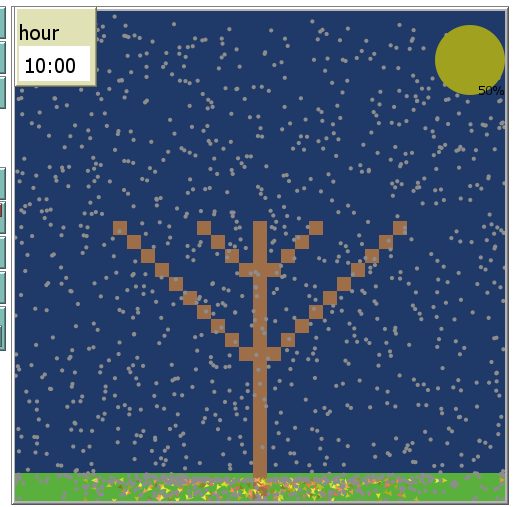
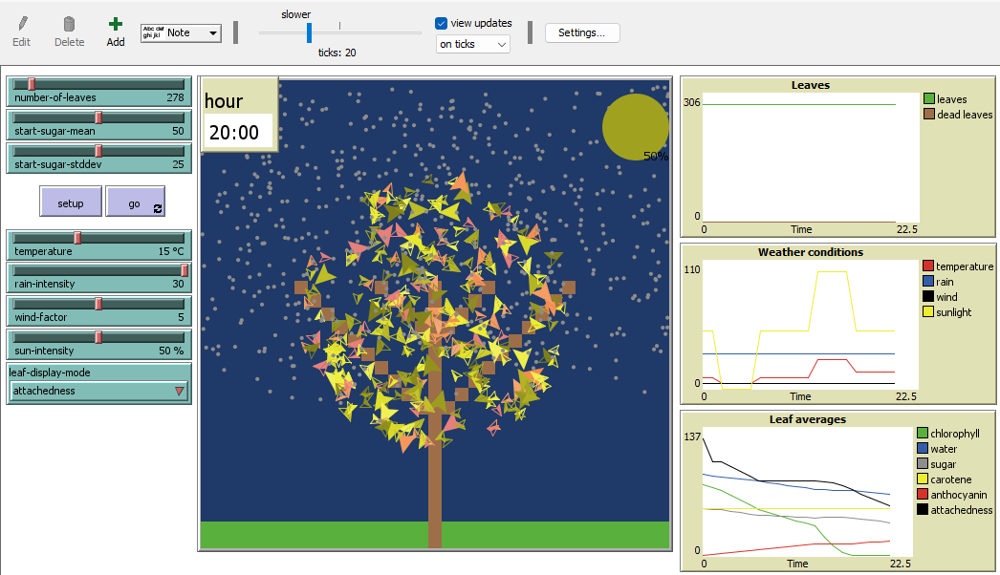
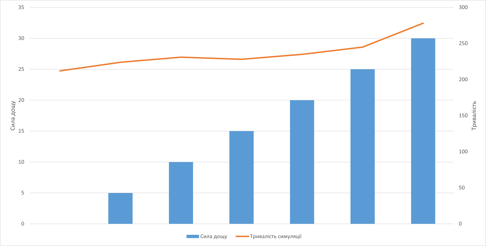

## Комп'ютерні системи імітаційного моделювання
## СПм-22-3, **Білоконь Антон Сергійович**
### Лабораторна робота №**2**. Редагування імітаційних моделей у середовищі NetLogo

 

### Варіант 11, модель у середовищі NetLogo:
[Autumn](https://www.netlogoweb.org/launch#http://www.netlogoweb.org/assets/modelslib/Sample%20Models/Biology/Autumn.nlogo), Додати добові цикли зміни інтенсивності сонячного світла, що також повинно впливати на температуру. Тривалість модельної "доби" встановлюється у внутрішніх параметрах.

 

### Внесені зміни у вихідну логіку моделі, за варіантом:

Була написана процедура **sun-day** для зміни інтенсивності сонячного світла у залежності від пройшовшого часу від початку симуляції:
<pre>
to sun-day
let time-of-day hour /  length-of-day * 24
  if time-of-day > 0 and time-of-day < 4 [           ;; 00:00 - 04:00
    set sun-intensity 0
    set temperature 5
  ]
  if (time-of-day > 4 and time-of-day < 10) [        ;; 04:00 - 10:00
    set sun-intensity 50
    set temperature 10
  ]
  if (time-of-day > 10 and time-of-day < 14) [       ;; 10:00 - 14:00
    set sun-intensity 100
    set temperature 25
  ]
  if (time-of-day > 14 and time-of-day < 20) [       ;; 14:00 - 20:00
    set sun-intensity 50
    set temperature 15
  ]
  if (time-of-day > 20 and time-of-day < 0) [        ;; 20:00 - 24:00
    set sun-intensity 0
    set temperature 5
  ]
end
</pre>

Тривалість задається внутрішнім параметром:
<pre>
length-of-day
</pre>
І становить 24:
<pre>
to setup
set length-of-day 24
</pre>
Хід часу задав у процедурі **go**:
<pre>
sun-day
set hour hour + 1
if hour >= length-of-day [ set hour 0 ]
</pre>

### Внесені зміни у вихідну логіку моделі, на власний розсуд:
Зробив залежність розміру листя від параметрів моделі:
<pre>
to set-shape-for-value [ value ]
  ifelse value > 75 [
    set shape "default"
    set size 2
  ] [
    ifelse value <= 25 [
      set shape "default one-quarter"
      set size 0.5
    ] [
      ifelse value <= 50 [
        set shape "default half"
        set size 1
      ] [
        set shape "default three-quarter"
        set size 1.5
      ]
    ]
  ]
end
</pre>

Додав лічильник часу:
Додав **Monitor**, що відображає значення внутрішнього параметру **hour** та наложив на цей монітор "**Note**", що містить символи ":00"

Скріншот моделі зі змінами в процесі симуляції:

## Обчислювальні експерименти
### 1. Вплив сили дощу на кількість часу, що листя буде триматись на дереві.
Досліджується залежність кількості тактів від керуючого параметру **rain-intensity**.
Інші керуючі параметри мають значення за замовчуванням:
- **number-of-leaves**: 278
- **start-sugar-mean**: 50
- **start-sugar-stddev**: 25
- **wind-factor**: 5
- **temperature**: 25
- **sun-intensivity**: 77

<table>
<thead>
<tr><th>Сила дощу</th><th>Тривалість симуляції</th></tr>
</thead>
<tbody>
<tr><td>0</td><td>212</td></tr>
<tr><td>5</td><td>224</td></tr>
<tr><td>10</td><td>231</td></tr>
<tr><td>15</td><td>228</td></tr>
<tr><td>20</td><td>235</td></tr>
<tr><td>25</td><td>245</td></tr>
<tr><td>30</td><td>278</td></tr>
</tbody>
</table>

Графік наочно показує, що при підвищенні інтенсивності дощу листя довше залишається на дереві. Але фактор сили дощу не дуже сильно впливає на загальний процес симуляції.
